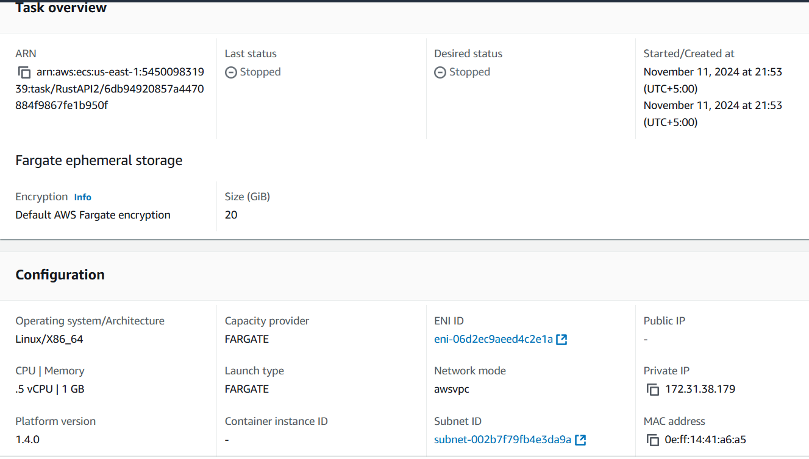
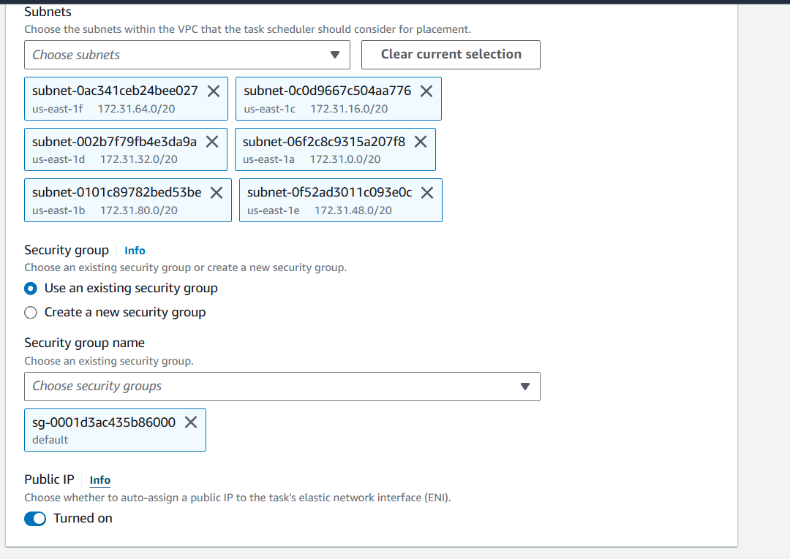

# cherubgyre
cherubgyre is an anonymous community defense social network

https://cherubgyre.com is under construction, but it's got some links.
https://api.cherubgyre.com has api docs.

## aws deployment instructions
1. First we need to push the code to the repo.
2. Open Cloudshell and create a repo in ecr
```
aws ecr create-repository --repository-name rust-api --region us-east-1
```

The created repo would return some params, note repoUri from that : `https://545009831939.dkr.ecr.us-east-1.amazonaws.com/rust-api`

3. Authenticate docker with aws

```
aws ecr get-login-password --region us-east-1 | docker login --username AWS --password-stdin 545009831939.dkr.ecr.us-east-1.amazonaws.com
```

4. Clone git in CloudShell. and checkout to required branch
```
git clone https://github.com/davidemerson/cherubgyre
cd cherubgyre
git checkout dockerization
```
5. Build Docker
```
docker build -t rust-api .
```   

6. Tag the Docker image for ECR:
```
docker tag rust-api:latest 545009831939.dkr.ecr.us-east-1.amazonaws.com/rust-api:latest
```
7. Push the image to ECR:
```
docker push 545009831939.dkr.ecr.us-east-1.amazonaws.com/rust-api:latest
```

6. Create an ecs cluster with AWS Fragate option.
7. Create a task definition with cluster uri got in previous step. Port 8080 should be adding in port openings


8. Run the Task & Test API. You should add security group to allow inbound traffic. I've added a security group for that



9. Your api is deployed. Check the url in cluster->task-details

`https://us-east-1.console.aws.amazon.com/ecs/v2/clusters/RustAPI2/tasks/ac6715e577ff4408839ea2d03f174303/configuration?region=us-east-1&selectedContainer=rust-api-container`

## toolchain setup for local development
1. Install rust, following instructions at https://rustup.rs
2. Clone this repo
3. Install RustRover from JetBrains (register for an account, free for non-commercial use)
4. Install lld linker for faster compile times
    ```
    brew install llvm
    ```
    or
    ```
    apt install llvm lld clang
    ```
    
5. Install cargo-watch to trigger commands when source code changes. Chain some commands so cargo watch runs check, (if successful) then test, (if successful) then run:
    ```
    cargo install cargo-watch
    cargo watch -x check -x test -x run
    ```
    
6. Install cargo-llvm-cov to measure code coverage, and run cargo llvm-cov to compute code coverage for the application.
   ```
   rustup component add llvm-tools-preview
   cargo install cargo-llvm-cov
   cargo llvm-cov
   ```
   
7. Make sure the linter "clippy" is installed. Run it to fail the pipeline if there are warnings.
   ```
   rustup component add clippy
   cargo clippy -- -D warnings
   ```
   
8. Add rustfmt for automatic code formatting. Run it using cargo fmt (or `cargo fmt -- ---check` if you'd prefer a formatting step for caution. I don't.)
   ```
   rustup component add rustfmt
   cargo fmt
   ```
   
9. Add cargo-audit for security audits. Run it to scan your dependency tree.
   ```
   cargo install cargo-audit
   cargo audit
   ```

### notes
- Check out `.github/workflows/general.yaml` in this repository: it will run some of the above fmt and clippy checks on every push to main.
- Check out `.github/workflows/audit.yaml` in this repository: it will run audits on every push to main.
- Tests will be in `tests/` here because it is preferable to externalize tests from the source for the purposes of visibility and security. We don't want to give tests any privileged access to the code.
